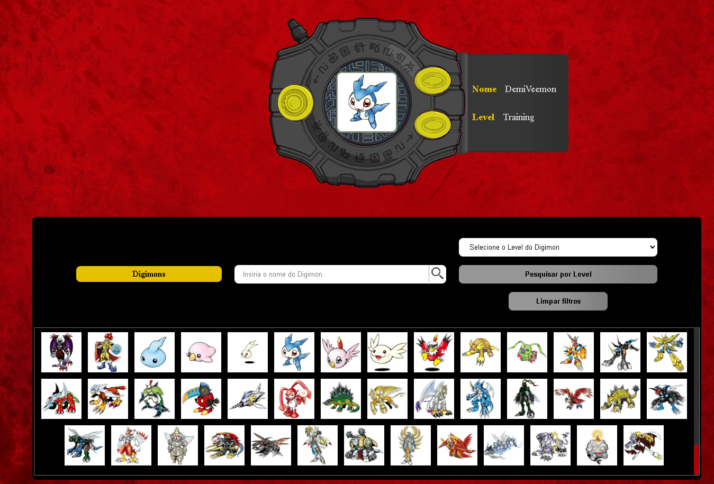

<h1 align="center"> Digivice </h1>

 O Digivice é uma aplicação que interage com uma API de Digimon. Ele permite aos usuários navegar por uma lista de Digimons e selecioná-los para visualização dentro de um Dispositivo Digimon. Além disso, o Digivice oferece funcionalidades de navegação, como botões para avançar e retroceder entre os Digimons exibidos. Também é possível obter informações detalhadas de um Digimon selecionado.

Além disso, o Digivice inclui recursos de filtro, permitindo aos usuários filtrar a lista de Digimons por nome e nível, resultando em uma renderização personalizada da lista de Digimons com base nos critérios de filtragem selecionados.

#### Deploy da aplicação

<a href="https://digivice-six.vercel.app/">Abrir aplicação</a>

#### Tecnologias utilizadas:
 - Angular Framework
 - Typescript
 - HTML
 - CSS

### Api Utilizada

- <a href="https://digimon-api.vercel.app/">Api digimon</a>

#### Digivice-Api

- <a href="https://github.com/cesarrafaeljunior/digivice_api">Abrir api</a>

#### Tecnologias utilizadas:
 - Java 17.0.6
 - Spring Boot 3.1.5
 - Maven
 - IntelliJ

